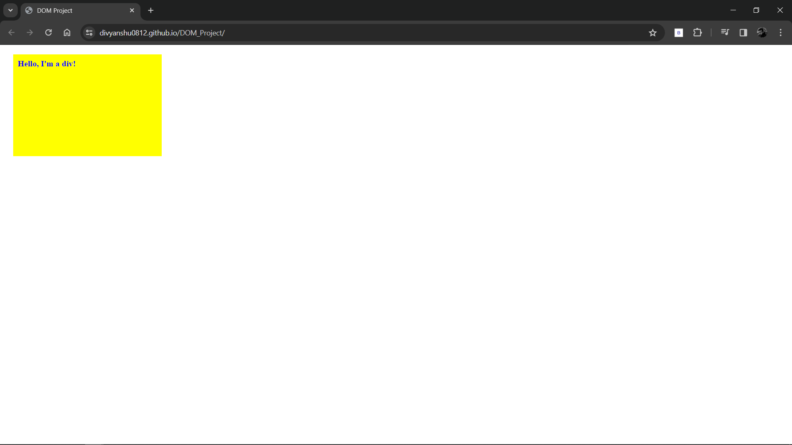

# DOM PROJECT

## Pages Overview

## `index.html`

The `index.html` page has basic HTML with one `
` tag and a `<script>` tag. 

## `index.js`

The `index.js` page has various DOM functions such as color, background color, margin, padding, font size, font-weight, height, and width.

## Screenshots

